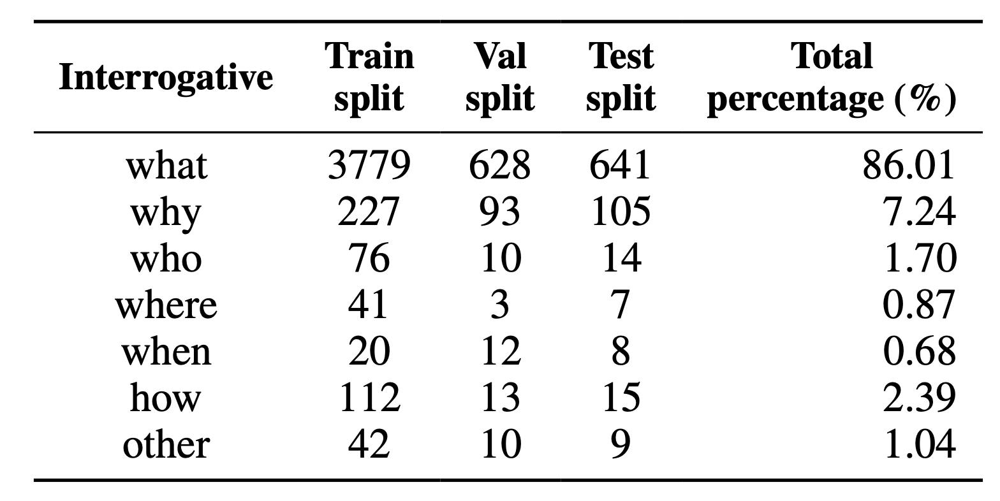
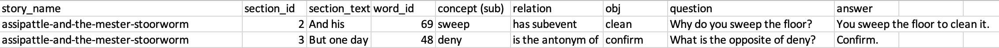

# StorySparkQA: A Dataset with External Commonsense Knowledge for Question and Answer Generation

<p align="center">
    <a href="https://arxiv.org/abs/2311.09756">
        
    </a>
    <a href="https://huggingface.co/datasets/NEU-HAI/StorySparkQA">
        
    </a>
    <a href="https://opensource.org/licenses/MIT">
        
    </a>
</p>

<p align="center">
Jiaju Chen, Yuxuan Lu, Shao Zhang, Bingsheng Yao, Yuanzhe Dong, Ying Xu, Yunyao Li, Qianwen Wang, Dakuo Wang, Yuling Sun
</p>

This repository contains the StorySparkQA dataset for our paper: [StorySparkQA: A Dataset for Narrative Comprehension with External Commonsense Knowledge for Children Education](https://arxiv.org/abs/2311.09756). This work is accepted at EMNLP 2024.

The StorySparkQA dataset is constructed based on FairytaleQA, which contains CSV file of 278 fairytale stories from Project Gutenberg and a set of questions and answer pairs (QA-pairs) developed by educational experts based on an evidence-based theoretical framework. 
StorySparkQA focuses on expanding external common-sense knowledge associated with source story texts to expand young children's knowledge about real-life.

## Annotation Framework

The annotation framework of StorySparkQA is a 3-step guided process, which aims to facilitate experts' thinking process and creation of real-world knowledge-enriched QA pairs.

* **Step1:** Concept Selection: Experts need to identify an educational-appropriate concept from the story for young children.
* **Step2:** Knowledge Matching: Experts need to select a real-world knowledge triple based on the identified concept.  This step connects story content with external real-world knowledge.
* **Step3:** QA pair Creation: Experts need to write a QA pair based on the selected triple.

To facilitate the annotation process by providing recommendations for external real-world knowledge, we design our annotation framework by retrieving and recommending real-world knowledge triples from ConceptNet, a publicly available, large-scale real-world Knowledge Graph.

The code for our annotation framework is presented in ```./Annotation Framework```.

## Dataset Statistics

<p align="middle">
    
    
</p>

The left table above shows the core statistics of StorySparkQA.

The table on the right shows the question type distribution in StorySparkQA.

<p align="middle">
    
</p>

The above table shows the statistics of StorySparkQA on train/val/test split separately.

## Repository Structure

The StorySparkQA dataset is splited by two methods:

**1. split stories into train/val/test splits(```./data-by-train-split```)**

* As FairytaleQA dataset is splited into train/val/test splits with a QA ratio of roughly 8:1:1, we follow the three splits and conduct experts' annotation based on them. The core statistics of each split is shown above.

**2. split stories based on their origin(```./data-by-origin```)**

* As stories are from [Project Gutenberg](https://www.gutenberg.org/), each story has a corresponding origin book. Stories are splited according to the book they are from in this method.

In addition, we combined stories under train/val/test split respectively, and present one CSV file for each split.

**3. merged files under train/val/test splits(```./data-merged-in-csv```)**

* Each CSV file corresponds to a split, including all the stories under this split and the triplets and QA-pairs annotated by educational experts.


### Data Structure
Although stories are splited in two variations, each story has a same data structure.
Each story is presented in the form of a CSV file, which consists of the following columns:

<p align="middle">
    
</p>

* ***story_name***: title of the fairytale story
* ***section_id***: index of the corresponding section of the current fairytale story. Sections are texts that are manually separated by educational experts at natural and semantical breaks of stories in FairytaleQA.
* ***section_text***: source text of the corresponding section
* ***word_id***: index of the concept word in the corresponding section text selected by educational experts. We use NLTK's [```word_tokenize```](https://www.nltk.org/api/nltk.tokenize.word_tokenize.html) to separate and identify each word in sections.
* ***concept(sub)***: first element of a triplet (i.e. $\[source Concept, relation, target Concept\]$). Concept word is selected by educational experts as the keyword of the corresponding section text. The external knowledge in the form of triplet are expanded based on concept.
* ***relation***: second element of a triplet (i.e. $\[source Concept, relation, target Concept\]$). Relation is the edge that conncets concept in source text and a related concept beyond the text.
* ***obj***: third element of a triplet (i.e. $\[source Concept, relation, target Concept\]$). This is an external concept of source text and related to the selected concept in the source text.
* ***question***: Question that experts created based on the triplet they selected, usually contain relation and either the source concept or target concept.
* ***answer***: Answer to the corresponding question created by experts, usually contain another concept in the triplet that is asked about in the quesiton.


## Future Work

One of our future exploration involves using our StorySparkQA and models fine-tuned on our dataset to develop a human-AI education system that aids parents and early educators in formulating questions during story readings, addressing their constraints in language, knowledge, time, or motivation.

## License
This project is licensed under the [MIT License](https://opensource.org/licenses/MIT).

## Citation

```
@inproceedings{chen2024storysparkqa,
  title={StorySparkQA: Expert-Annotated QA Pairs with Real-World Knowledge for Children’s Story-Based Learning},
  author={Chen, Jiaju and Lu, Yuxuan and Zhang, Shao and Yao, Bingsheng and Dong, Yuanzhe and Xu, Ying and Li, Yunyao and Wang, Qianwen and Wang, Dakuo and Sun, Yuling},
  booktitle={Proceedings of the 2024 Conference on Empirical Methods in Natural Language Processing},
  pages={17351--17370},
  year={2024}
}
```
